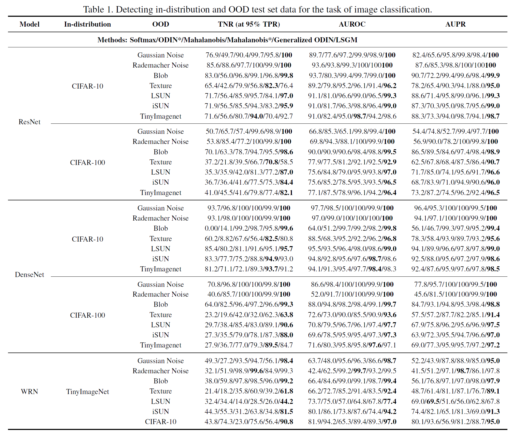

# Joint Distribution across Representation Spaces for Out-of-Distribution Detection

This repository contains the essential code for the paper *Joint Distribution across Representation Spaces for Out-of-Distribution Detection*.

## Preliminaries

The code is tested under Ubuntu Linux 16.04 and Python 3.8 environment, and requries the following packages to be installed:

* [PyTorch](http://pytorch.org/)
* [scipy](https://github.com/scipy/scipy)
* [scikit-learn](http://scikit-learn.org/stable/)
* [numpy](https://numpy.org/)

## Out-of-Distribtion Datasets

Some out-of-distributin datasets we use are from torchvision, and the links of the others are provided here:

* [Tiny-ImageNet](https://www.dropbox.com/s/kp3my3412u5k9rl/Imagenet_resize.tar.gz)
* [LSUN](https://www.dropbox.com/s/moqh2wh8696c3yl/LSUN_resize.tar.gz)
* [Textures](https://www.robots.ox.ac.uk/~vgg/data/dtd/)
* [iSUN](https://www.dropbox.com/s/ssz7qxfqae0cca5/iSUN.tar.gz)

## How to use

```bash
# model: DenseNet, in-distribution: CIFAR-100, batch_size: 200
$ cd CIFAR
$ python test_lsgm.py --method_name densenet_cifar100 --test_bs 200
```

## Experimental Result

This followings are the experimental results, which is the same as in the paper.


